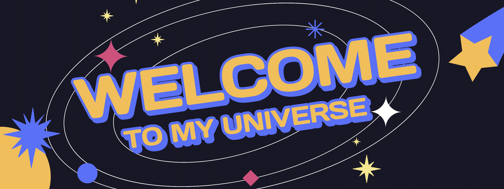

<!--Banner-->

<!--Night Owl image-->

  

<!--Header Name-->
#  ɪ'ᴍ Rᴀʜᴜʟ! 
*Builder of Digital Realities | Full Stack Problem Solver*
  

<!--Start Intro-->               

I am a Full Stack Developer and Software Engineering Enthusiast with a deep passion for Java, Spring Boot, AngularJS, React.js, Python, MySQL, REST APIs, and building scalable web applications. My focus lies in crafting seamless digital solutions through innovation and collaboration.

✨ Lifelong Learner :)
- 🌱 I’m currently exploring advanced web development techniques, system design, and cloud technologies. Every day is an opportunity to grow!
- 💁‍♂️ Active member of developer communities, contributing knowledge and fostering collaboration.
- 🏙 An advocate for continuous learning and mentoring in software development.
- ✍ I write technical blogs about Java, Spring Boot, and Full Stack Development. Stay tuned for updates on my [Blog](https://rahuldevligri.medium.com/).
- ❤ Passionate about contributing to Open Source projects and collaborative innovation.
- 💻 Check out my [Portfolio](https://rahuldevligri.github.io) for more details about me.
<!--End Intro-->

<!--Profile Count Badge-->

  

---

<!--Languages and Tools Section-->       
<h2 align="center">Mʏ Tᴇᴄʜ Sᴛᴀᴄᴋ & Rᴇᴄᴇɴᴛ Cᴏɴᴛʀɪʙᴜᴛɪᴏɴs</h2> 
<picture>
  <source media="(prefers-color-scheme: dark)" srcset="./Skills_Animation_Dark.gif">
  <source media="(prefers-color-scheme: light)" srcset="./Skills_Animation_White.gif">
  
</picture>
 

<h3 align="left">Current Learning</h3>
<ul align="left">
  <li>Building real-time applications with Spring Boot &  AngularJS.</li>
  <li>Enhancing expertise in Java microservices architecture and event-driven systems.</li>
  <li>Improving Full Stack Development skills with Spring Boot, Angular, Docker & AWS.</li>
</ul>
  
<h3 align="left">Latest Projects</h3>
<ul align="left">
  <li><a href="https://www.linkedin.com/in/rahuldevligri/">🏥Doctor Appointment System: Book, cancel, and track appointments seamlessly.🔖</a></li>
  <li><a href="https://github.com/rahuldevligri/sso_implementation">🧙‍♂SSO Integration: Secure authentication with SAML Assertion, MetaData & Spring Boot.</a></li>
  <li><a href="https://github.com/rahuldevligri/Kafka-deliveryboy-location-producer">🚀 Kafka Microservices: Consumer & producer for location updates.</a></li>
</ul>
 
 
 
 

<!--Trophies Section-->   
<h2 align="center" style="color: #FFD700;">🏆 Gɪᴛʜᴜʙ Tʀᴏᴘʜɪᴇs 🏆</h2>

  

 

<!--Github stats Table--> 
<h2 align="center" style="color: #FFD700;">📊 Gɪᴛʜᴜʙ Sᴛᴀᴛs 📊</h2>
<table width="100%">
  <tr>
    <td width="50%">
      <h3 align="center"><strong>Gɪᴛʜᴜʙ Sᴛᴀᴛs</strong></h3>
      

        
      

    </td>
    <td width="50%">
      <h3 align="center" style="color: #4F86F7;"><strong>Sᴛʀᴇᴀᴋ Sᴛᴀᴛs</strong></h3>
      

        
      

    </td>
  </tr>
  <tr>
    <td width="50%">
      <h3 align="center" style="color: #4F86F7;"><strong>Lᴀᴛᴇsᴛ Pʀᴏᴊᴇᴄᴛ</strong></h3>
      

        
      

    </td>
    <td width="50%">
      <h3 align="center" style="color: #4F86F7;"><strong>Tᴏᴘ Cᴏɴᴛʀɪʙᴜᴛɪᴏɴs</strong></h3>
      

        
      

    </td>
  </tr>
</table>
 

<!--Contribution Graph-->
<h2 align="center">📈 Cᴏɴᴛʀɪʙᴜᴛɪᴏɴ Gʀᴀᴘʜ 📈</h2>

    

---

<!--Dynamic Quote Card-->
<h2 align="center" style="color: #FFD700;">🌟 Tʜᴏᴜɢʜᴛ ᴏғ ᴛʜᴇ Dᴀʏ 🌟</h2>

<!--STARTS_HERE_QUOTE_CARD-->

    

<!--ENDS_HERE_QUOTE_CARD-->

<!--Contact Section--> 

<h2 align="center">🤝 Cᴏɴɴᴇᴄᴛ Wɪᴛʜ Mᴇ 🤝 </h2>

  

 

<!--Buy me a coffee-->

<!--Footer--> 

  

